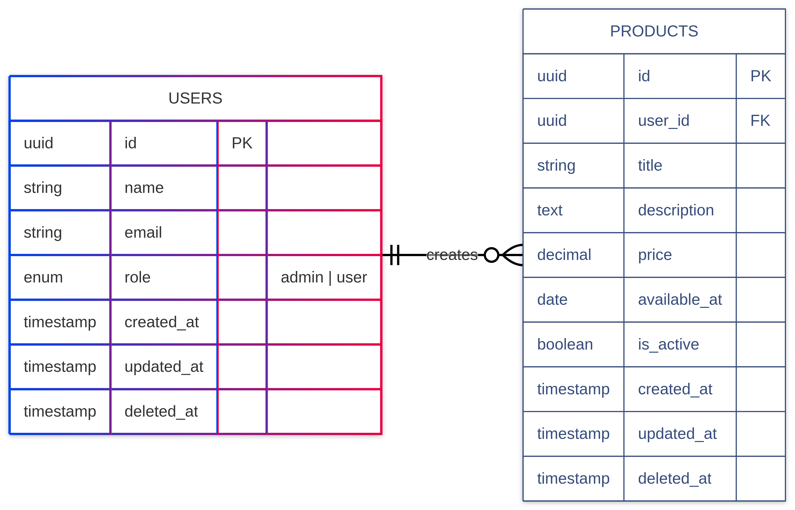

# Laravel Product Management System

Basic Laravel application for managing products, featuring secure authentication, role-based access control, full CRUD operations, and optimized search capabilities. The application follows modern PHP standards with emphasis on security, performance, and maintainable architecture.

---

## Table of Contents

- [Features](#-features)
- [Tech Stack](#-tech-stack)
- [System Architecture](#-system-architecture)
- [Installation & Deployment](#-installation--deployment)
- [Security Implementation](#-security-implementation)
- [Performance Optimization](#-performance-optimization)
- [Challenges & Solutions](#-challenges--solutions)
- [Future Improvements](#-future-improvements)
- [API Documentation](#-api-documentation)


## ✨ Features

- **Authenticated Access**: Secure login system.
- **Product Management**: Create, Read, Update, and Delete products.
- **Rich Content**: Support for rich text descriptions.
- **Advanced Search**: Filter products by keyword with optimized database queries.
- **Role-Based Access Control**: Granular permissions (Admin vs User).
- **Automated Deployment**: One-click setup using Docker Compose.

## 🚀 Tech Stack

- **Framework**: Laravel 12.x
- **Backend**: Nginx Alpine, PHP-FPM 8.3
- **Frontend**: HTML, CSS, JavaScript, Tailwind CSS
- **Database**: MySQL 8.0
- **Authentication**: Laravel Sanctum (API Authentication)
- **Testing**: PHPUnit
- **ORM**: Eloquent
- **Build Tools**: Composer, Vite
- **Deployment**: Docker Compose (Nginx Alpine, PHP-FPM 8.3, MySQL 8.0, Redis)

## 🛠 System Architecture

This project follows the **Repository-Service Pattern** to ensure separation of concerns, testability, and maintainability.

### 1. **Service Layer (`App\Services`)**
   - **Purpose**: Encapsulates business logic.
   - **Benefit**: Keeps Controllers "thin". The Controller's only job is to receive the request, assign to the Service, and return the response.

### 2. **Repository Layer (`App\Repositories`)**
   - **Purpose**: Abstraction layer for data access.
   - **Benefit**: Decouples the business logic from the specific ORM or database. Makes it easier to switch data sources or mock data for testing.
   - **Optimization**: All Eloquent queries (e.g., `Product::where(...)`) are contained here.

### 3. **Centralized Validation (`Form Requests`)**
   - **Strict Validation**: All incoming data is validated using dedicated Form Request classes (e.g., `StoreProductRequest`).
   - **Security**: Ensures no invalid or malicious data reaches the Service layer.

### 4. **Role-Based Access Control (RBAC)**
   - **Implementation**: Simple, database-driven role system without external packages like Spatie.
   - **Structure**: `users` table contains a `role` column (or relation).
   - **Enforcement**:
     - **Gates & Policies**: Used for authorization checks (e.g., `can('create-product')`).
     - **Middleware**: Routes are protected by role-based middleware.

### 5. **Universal Unique Identifiers (UUIDs)**
   - **Implementation**: All primary keys (Users, Products, Roles) use UUIDs instead of standard auto-incrementing integers.
   - **Benefit**: Enhanced security (preventing ID enumeration) and better support for distributed systems.

## ER Diagram



## 📁 Project Structure

```
app/
├── Http/
│   ├── Controllers/
│   │   ├── Admin/               # Admin-specific controllers
│   │   │   ├── UserController.php
│   │   │   └── ProductController.php
│   │   ├── Api/                 # API controllers
│   │   │   ├── ProductController.php
│   │   │   ├── UserController.php
│   │   │   └── BaseController.php
│   ├── Middleware/              # Middleware for role-based access control
│   │   ├── AdminMiddleware.php
│   │   └── CheckPermission.php
│   └── Requests/                # Form requests for validation
│       ├── ProductRequest.php
│       └── UpdateProductRequest.php
├── Models/                      # Eloquent models
│   ├── User.php
│   └── Product.php
├── Services/                    # Business logic
│   ├── ProductService.php       
│   └── SearchService.php       
├── Repositories/                # Data access layer
│   ├── ProductRepository.php    
│   └── Interfaces/              # Interface for repository
│       ├── ProductRepositoryInterface.php
│       └── UserRepositoryInterface.php
└── Providers/                   # Service providers
    └── RepositoryServiceProvider.php
```

## 🐳 Installation & Deployment

The project includes a fully automated `docker-compose` setup.

### Prerequisites
- Docker & Docker Compose

### Quick Start
1. **Clone the repository**
   ```bash
   git clone https://github.com/sreeharshrajan/laravel-product-management-system.git
   cd laravel-product-management-system
   ```

2. **Run the deployment script**
   ```bash
   # Make script executable
   chmod +x deploy.sh

   # Run deployment
   ./deploy.sh
   ```
   This script will:
   - Copy `.env.example` to `.env`.
   - Build and start Docker containers.
   - Install Composer dependencies.
   - Generate App Key.
   - Run Database Migrations.
   - Set file permissions.

3. **Access the Application**
   - Web: `http://localhost:8080`
   - Database: `mysql:3306`

## 🔒 Security Implementation

- **CSRF Protection**: All non-read HTTP requests are protected by Laravel's CSRF tokens.
- **XSS Prevention**: Blade templating automatically escapes output.
- **SQL Injection**: Eloquent ORM uses prepared statements by default.
- **Input Validation**: Strict type checking and validation rules.

## ⚡ Performance Optimization

- **Database Indexing**: Searchable fields like `title` and `date_available` are indexed to ensure fast `WHERE` clauses.
- **Eager Loading**: Code is audited to prevent N+1 query problems (using `with()`).
- **Pagination**: All list endpoints use server-side pagination to handle large datasets efficiently.
- **Optimization Commands**: Deployment script runs `config:cache`, `route:cache`, and `view:cache`.

## 🧩 Challenges & Solutions

### 1. **Handling Soft Deletes in Unique Validations**
- **Challenge**: Soft-deleted products could cause unique constraint violations if a new product used the same title.
- **Solution**: Used validaton rules like `Rule::unique('products')->withoutTrashed()` to ensure uniqueness ignores deleted records, or explicitly checked active records.

### 2. **Efficient Search on Large Datasets**
- **Challenge**: Simple `LIKE %...%` queries can be slow on large tables.
- **Solution**: Added database indexes on searchable columns (`title`) and implemented query scopes to encapsulate search logic.

### 3. **Rich Text Editor Security**
- **Challenge**: Rich text editors can be used to inject malicious content.
- **Solution**: Implemented a whitelist of allowed HTML tags and attributes using the `HTMLPurifier` library.

## 🔮 Future Improvements

If this were a large-scale SaaS product, I would introduce:
- **API Versioning**: For mobile/external consumers.
- **Caching Layer**: aggressive Redis caching for read-heavy product lists.
- **Elasticsearch/Meilisearch**: For more advanced full-text search capabilities beyond SQL `LIKE`.
- **Queued Exports**: For handling large data exports asynchronously.
- **CI/CD Pipeline**: GitHub Actions for automated testing and deployment.

## 📚 API Documentation

### Authentication

| Method | Endpoint | Description |
| :--- | :--- | :--- |
| `POST` | `/api/register` | Register new user |
| `POST` | `/api/login` | Login user |
| `POST` | `/api/logout` | Logout user |
| `POST` | `/api/refresh` | Refresh token |

### Products

| Method | Endpoint | Description |
| :--- | :--- | :--- |
| `GET` | `/api/products` | List all products |
| `POST` | `/api/products` | Create product (Admin) |
| `GET` | `/api/products/{id}` | Get single product |
| `PUT` | `/api/products/{id}` | Update product (Admin) |
| `DELETE` | `/api/products/{id}` | Delete product (Admin) |
| `GET` | `/api/products/search?q=` | Search products |

### Admin Endpoints

| Method | Endpoint | Description |
| :--- | :--- | :--- |
| `GET` | `/api/admin/users` | List users |
| `PUT` | `/api/admin/users/{id}` | Update user role |
| `GET` | `/api/admin/analytics` | Get system analytics |

### 🔐 Authentication

All API endpoints (except login/register) require:

`Authorization: Bearer {jwt_token}`

## 🧪 Testing

### Test Coverage

```bash
# Run tests
php artisan test

# Test coverage
php artisan test --coverage-html coverage/

# Specific test suites
php artisan test --testsuite=Feature
php artisan test --testsuite=Unit
```

### ✅ Test Categories

- **Unit Tests**: Models, Services, Repositories
- **Feature Tests**: API endpoints, Authentication

## 📝 Code Standards

- Follow **PSR-12** coding standards
- Write meaningfully commit messages
- Add tests for new features
- Update documentation accordingly

## 📞 Contact

- **Developer**: Sreeharsh K
- **Position**: PHP Developer
- **Email**: sreeharshkrajan@gmail.com
- **Date**: 2026-02-06
- **Repository**: https://github.com/sreeharshkrajan/laravel-product-management
